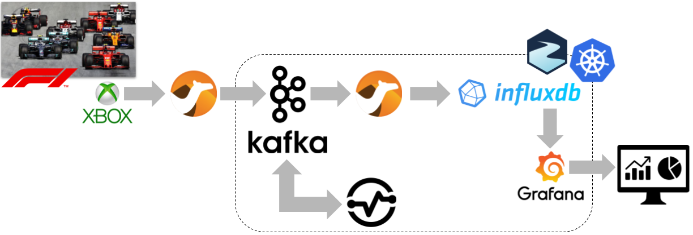

# devconfcz-2021-formula1-kafka-streams

Demo session at DevConf.cz 2021 "Formula 1 telemetry processing using Kafka Streams"

* [Slides deck](https://www.slideshare.net/paolopat/formula-1-telemetry-processing-using-kafka-streams)
* Video recording

You can find all the steps about running the demo on the official Formula 1 telemetry with Apache Kafka [repository](https://github.com/ppatierno/formula1-telemetry-kafka).